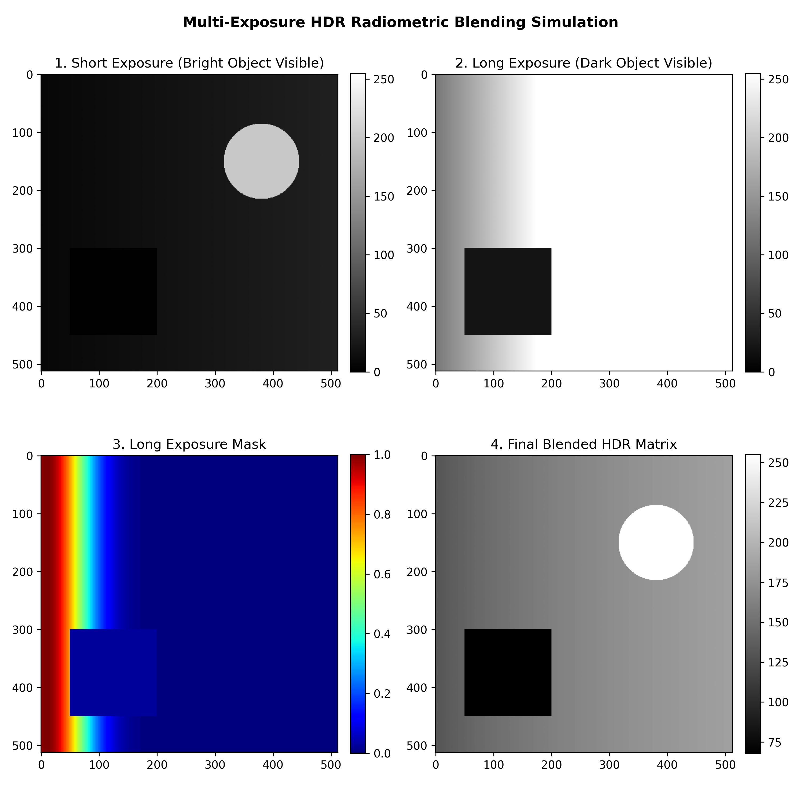

# Electro-Optical Multi-Exposure HDR Radiometric Blending Simulator

## Project Overview
This Python simulation models how to handle scenes with extreme, high-contrast lighting for electro-optical payload testing.

Standard camera sensors have full-well capacity limits (how many photons a pixel can count before overflowing). Objects hidden in deep shadows can be captured with long exposures, but brighter objects are washed out from the collection of excess higher range counts. In a standard 0-255 dynamic range, the 255 limit is met for many more pixels, hence the wash out of bright objects. However, for shorter exposures the bright details are well-captured, but dark objects and shadows drop below the sensor's noise floor and are washed out on the low end of the dynamic range.

This script simulates capturing a high-contrast scene at three distinct exposure steps (short, medium, and long). It then applies a Gaussian weighting matrix to automatically filter corrupted or saturated pixel blending the desried data into a single, high-dynamic-range (HDR) image array.

## How the Blending Pipeline Works

1. **Synthetic Scene Generation:** Creates a baseline image grid featuring a dark shadow zone and a very bright target of 800 counts to exceed standard 8-bit dynamic range limit.
2. **Sensor Exposure Simulation:** Generates three raw 8-bit image layers based on exposure timing scalars ($0.25\times$, $1.0\times$, $4.0\times$), enforcing strict hardware clipping limits (0 to 255).
3. **Radiometric Weight Masking:** Passes each frame through a Gaussian response curve to score pixel quality based on its proximity to the mid-tones (127.5). If a pixel hits hard clipping limits ($\le 1$ or $\ge 254$), its weight is scaled to **zero** so it cannot corrupt the calculations.
4. **Linear Matrix Fusion:** Re-scales the frames to a shared linear photon count range, multiplies them by their corresponding normalized weight maps, and outputs the final wide-dynamic-range matrix. 

## Tracking the Results
The colormap on **Panel 4 (Fused Blended HDR Output Matrix)** shows that the final image scale spans **800 counts**, and both geometric features are visible, proving the algorithm successfully expanded the simulated sensor's dynamic range.
